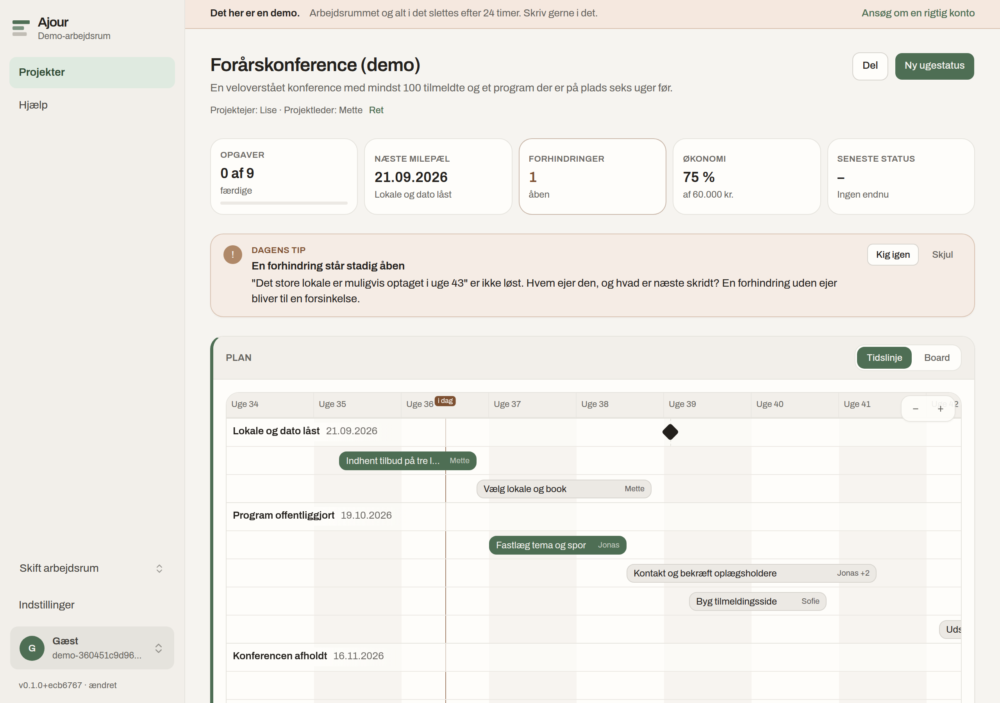
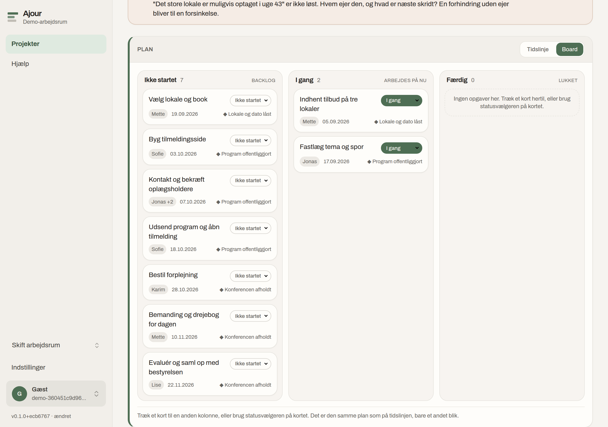
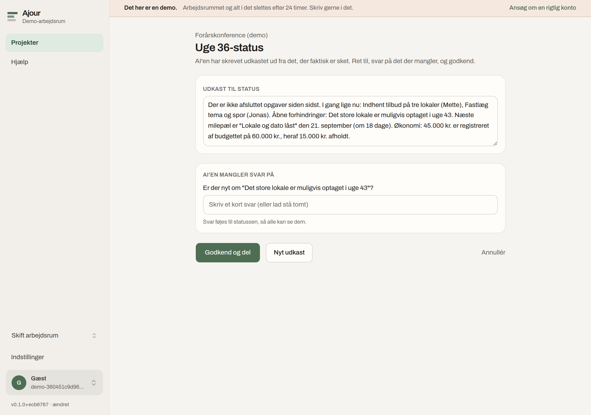
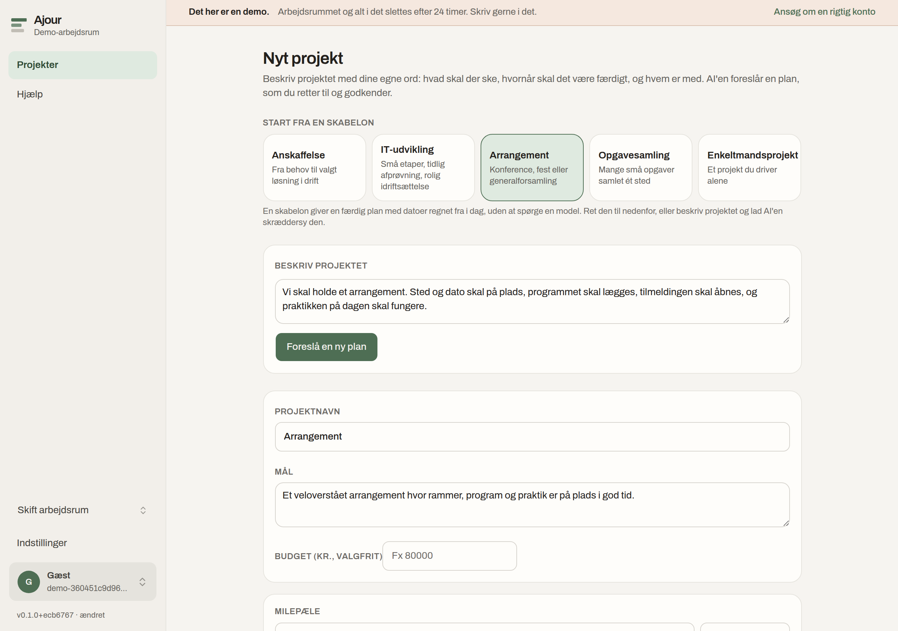
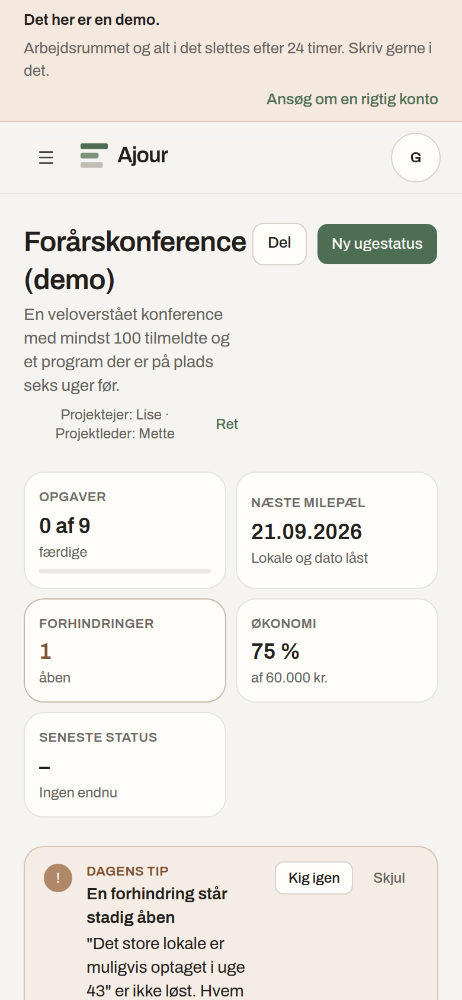

# Ajour

Ajour ([ajour.haij.dk](https://ajour.haij.dk)) is an open source project
tool for small projects with 2 to 10 people: the customer project at the
consultancy, the campaign in the marketing team, the renovation in the
housing association, the conference run by volunteers. Most project tools
are built to make plans. This one is built to keep them alive: the AI
gathers what happened, drafts the week's status and proposes changes when
reality moves, and a person decides. Three flows carry the product — Start
(from a description to a plan), Ugen (a status approved in one minute) and
Skred (a replan you say yes to) — on a plan that is always a timeline you
can drag, or a kanban board if you prefer.

Ajour is one tool in the [Haij](https://haij.dk) family and stands on the
Haij foundation: Danish-first, EU-sovereign, secure by design. The project
constitution — dogmas, principles, architecture and rules — lives in
[CLAUDE.md](CLAUDE.md). Decisions and their trade-offs live in
[docs/adr](docs/adr/).

## Status

Complete as a product, not yet run in anger. Four waves are done: the
foundation (auth with passkeys and TOTP, workspaces separated in the
database, admission by application, the audit log, CI, Docker), the
product itself (the seven concepts, the three flows, the timeline, the
board, the AI chat that acts on the whole project, share links, export and
deletion), accessibility and hardening (WCAG 2.1 AA, every action on the
keyboard, the AI's writes scoped twice), and the demo. Dogma seven is the
one still open: Ajour runs a real project before it goes in the window.

What that means for you: the code is public and you are welcome to run it,
read it, report what you find and send changes. The instance at
ajour.haij.dk admits people by application; there is a demo at `/demo` if
the installation has turned it on. Before 1.0 a migration may still change
its mind.

Much of the code is written together with Claude Code, under the rules in
[CLAUDE.md](CLAUDE.md). Every change is reviewed, tested and deployed by a
person; the tests for tenancy isolation are the part of the codebase that
is trusted least to good intentions.

## What it looks like

The project page: the plan as a timeline, the week's numbers, the AI's tip
for today, and one card per thing a project is made of.



The same plan as a board, for people who think in columns. Every card
carries its state select, so nothing here needs a drag.



Ugen: the AI reads what actually happened, writes the draft and asks about
what it could not know. You edit and approve; what is stored is the text
plus the plan as it stood that day.



Start: a template or a description becomes a proposal you edit on a live
timeline. Nothing is written until you say yes to it.



And on a phone, because an update has to be doable in under a minute on
the bus.



## Haij-dogmerne

Ajour lever efter familiens syv dogmer. De står her i Haijs egne ord.

1. **Ægte open source.** Al kode ligger offentligt under AGPL-3.0. Alt vi driver, kan hentes 1:1 og køres et andet sted eller lokalt, og der findes ingen funktioner der kun kan fås på haij.dk. En betalt udgave er i orden, men den bygger på den samme kode. Kloner man repoet, får man præcis det der kører på haij.dk.

2. **Egen drift.** Hvert værktøj kan køre i eget driftsmiljø på én server med Docker Compose, en Postgres og en lokal sprogmodel gennem Ollama, uden en eneste nøgle til en sky. Funktioner der forudsætter en ekstern tjeneste, som CVR-opslag eller e-faktura, siger det direkte og lader resten virke i stedet for at gå i stykker. Testen er enkel: afbryd forbindelsen til internettet, og alt væsentligt skal stadig virke.

3. **Dine data, altid.** Alt en organisation ejer kan hentes ud med ét klik i åbne formater (regneark, JSON, PDF) uden at spørge nogen, og slettes helt igen. At forlade Haij skal kunne gøres med få klik uden unødvendig friktion, og vi hjælper gerne med flytningen frem for at gøre den besværlig.

4. **EU eller egen drift.** Når vi hoster, ligger alt hos EU-ejede leverandører på EU-jord, sprogmodeller inklusive, og hvert værktøj har en offentlig liste over hvem der kan se hvad. Ingen amerikansk sky i driften. Koden ligger på GitHub, som er kodehosting og ikke kundedata; et spejl hos en europæisk forge kommer den dag det giver mening.

5. **AI'en hjælper, mennesket bestemmer.** AI må foreslå, skrive udkast og rette i planer, men aldrig sende noget ud af ”huset”, slette noget eller forpligte nogen uden at et menneske har sagt ja. Alt AI gør, kan fortrydes. Indhold hentet udefra behandles som data, aldrig som instruktioner.

6. **Sikkerhed fra første dag.** Organisationers data er adskilt i databasen, ikke kun i koden, og der skal være en test der beviser det. Alle ændringer registreres i en log der ikke kan redigeres. Passkeys og totrinslogin er der fra start, der er en offentlig vej til at melde sikkerhedshuller, og der ligger aldrig hemmeligheder i koden.

7. **Brugt i virkeligheden.** Intet af det vi selv har bygget kommer i vinduet før det har kørt rigtigt arbejde, hos os selv eller hos en kunde vi sidder tæt på. Værktøjer fra andre skal have et rigtigt brugssted vi kan pege på. Vi skal ikke have værktøjer liggende som ikke har skabt reel værdi i virkeligheden.

## Quickstart

Requirements: Node 22+, pnpm 10+ (`brew install pnpm`; newer Node builds no longer bundle corepack), Docker.

```bash
git clone https://github.com/MartinNymannVinther/ajour.git && cd ajour
pnpm install
cp .env.example .env                            # defaults work for local dev
docker compose -f docker-compose.dev.yml up -d --wait  # Postgres 16 + runtime roles, ready
pnpm db:migrate                                 # tables, RLS, audit triggers
pnpm dev                                        # http://localhost:3000
```

Register at `/register` — signup creates your user and your workspace —
then add a passkey under Indstillinger → Sikkerhed. Registration is closed
by default (`SIGNUP=closed`): an empty installation always lets the first
person in, the door shuts by itself once that account exists, and everyone
after that applies at `/register` and is admitted by the installation's
owner with a single-use link (Indstillinger → Adgang).

```bash
pnpm test        # RLS isolation, signup gate, admission, foundation checks
pnpm lint && pnpm typecheck
```

The tests run against the database from the compose file and never call
an AI model, so they pass offline and without keys.

Two things the first run can trip over, both of which `pnpm db:migrate`
now names when they happen. The Postgres image has to be pulled and the
cluster initialised the first time, so `--wait` matters; a migrate fired
before that is done fails and leaves an empty database behind. And if
another Postgres already holds port 5432 on your machine (Haij's dev
database, a local install), Ajour's container comes up without its port
and the migration talks to the wrong server: set `POSTGRES_PORT=5433` in
`.env` and change the three URLs to match.

## Running it for real

[docs/launch.md](docs/launch.md) is the ordered checklist for taking an
installation live the first time, including the two steps that are painful
to get wrong: the public URL passkeys bind to, and creating the first
account before anybody else finds the address.
[docs/deploy.md](docs/deploy.md) is the deployment guide behind it: Docker
Compose on an EU VPS, with Coolify doing the plumbing. Which third parties can
see data, and what, is listed in
[docs/subprocessors.md](docs/subprocessors.md) — today that is the
hosting provider and the AI provider you choose. With `LLM_PROVIDER=ollama`
nothing leaves the server at all.

## Contributing and security

[CONTRIBUTING.md](CONTRIBUTING.md) explains how changes are made here:
plan first, vertical slices, tests where they matter, an ADR for every
decision worth arguing about later. Found a security problem? Please
report it privately as described in [SECURITY.md](SECURITY.md) rather
than in a public issue.

License: [AGPL-3.0](LICENSE). The Archivo typeface in `public/fonts` is by the Archivo Project Authors under the [SIL Open Font License 1.1](public/fonts/OFL.txt).
